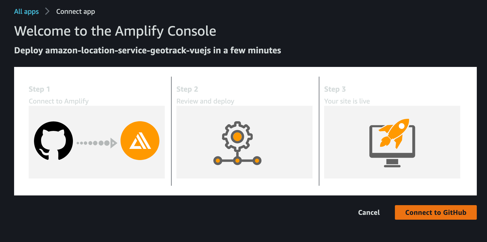
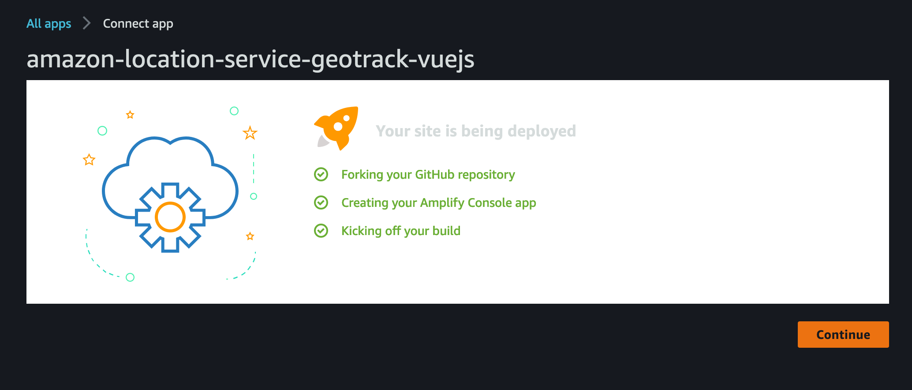
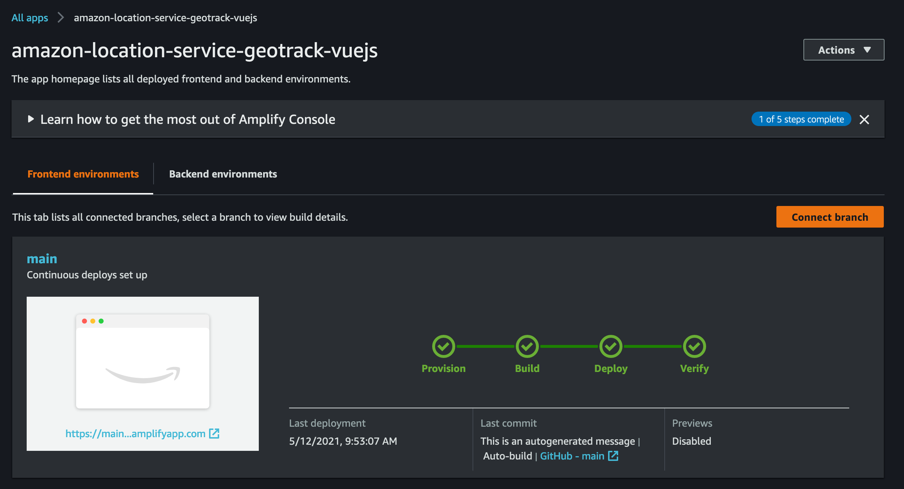

# Requirements
Before you deploy, you must have the following in place:
*  [AWS Account](https://aws.amazon.com/account/) 
*  [GitHub Account](https://github.com/) 
*  [AWS CLI](https://aws.amazon.com/cli/) 
*  [AWS SAM](https://aws.amazon.com/serverless/sam/) 
 
# Step 1: Front-end deployment

Before install Amplify we need to create the IAM Role that associate the policies need to implement this solution. From the cloned directory, execute the follow CloudFormation template: 

```bash
aws cloudformation deploy --template-file cfn-amplifyRole.yaml --stack-name geotrack-amplify-role --capabilities CAPABILITY_NAMED_IAM
```

It creates the role name **amplifyconsole-geotrack-backend-role** that will be used on the next step.

The **Deploy to Amplify Console** button will take you to your AWS console to deploy the front-end solution.

<a href="https://console.aws.amazon.com/amplify/home#/deploy?repo=https://github.com/aws-samples/amazon-location-service-geotrack-vuejs">
    
</a>


The follow screenshots shows how simple this step is:

1. 

2. 

3. 

4. 

# Step 2: Back-end deployment

In this step we create the IoT Core and associate it to the AWS Lambda function, so it can send the GPS coordinates to Amazon Location Service Tracker.

